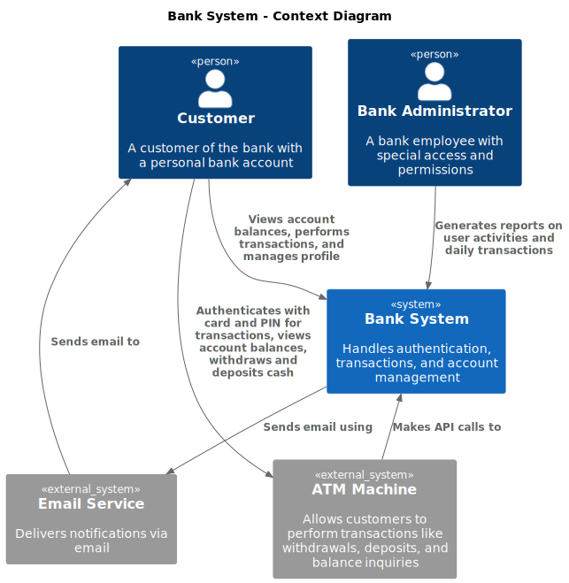
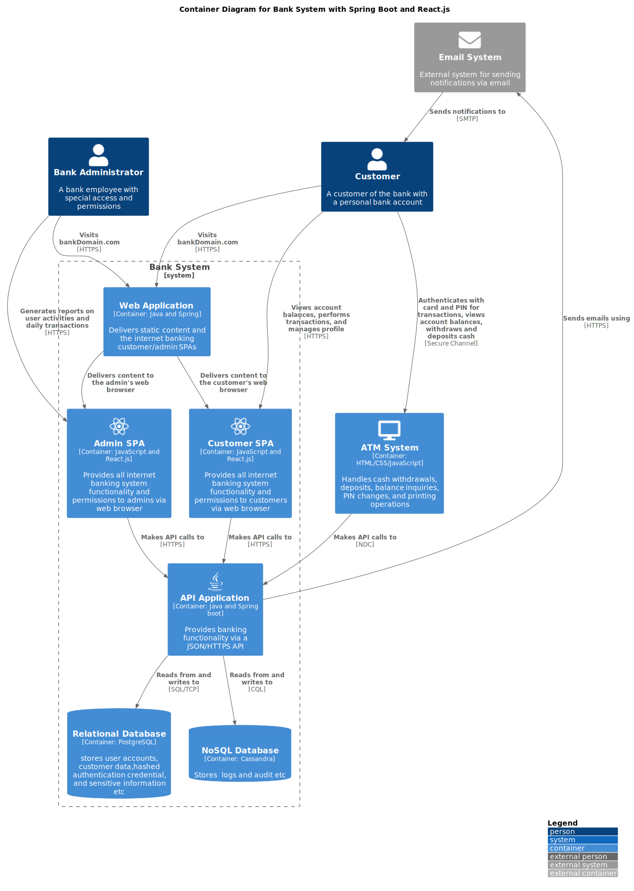
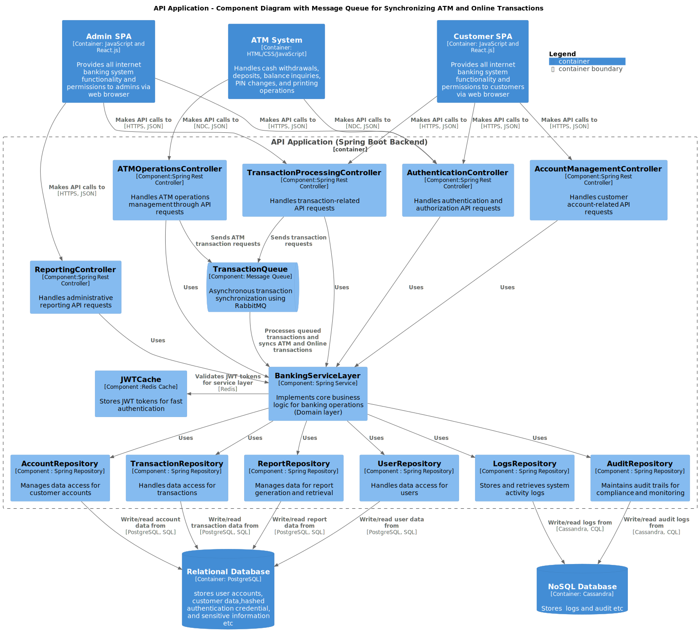
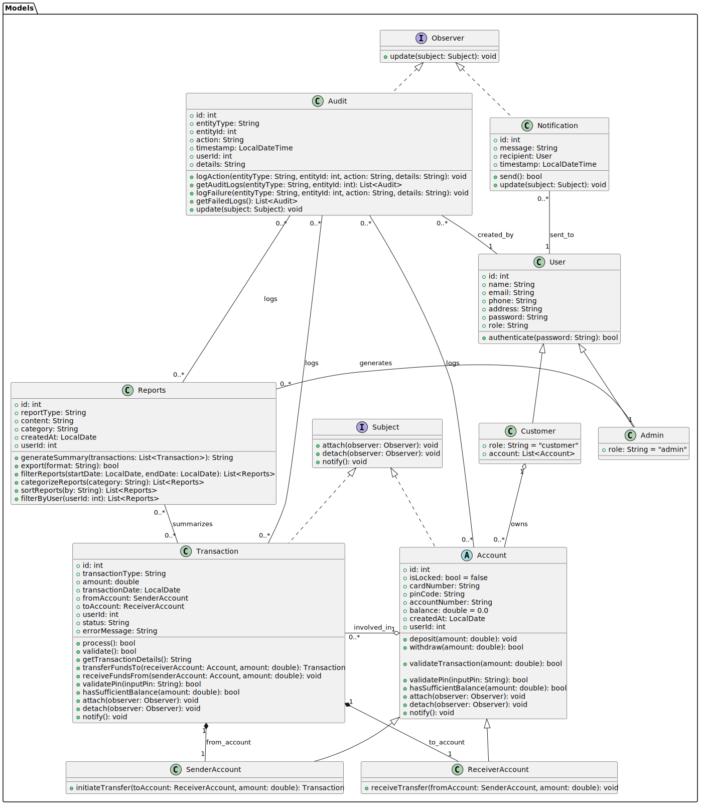
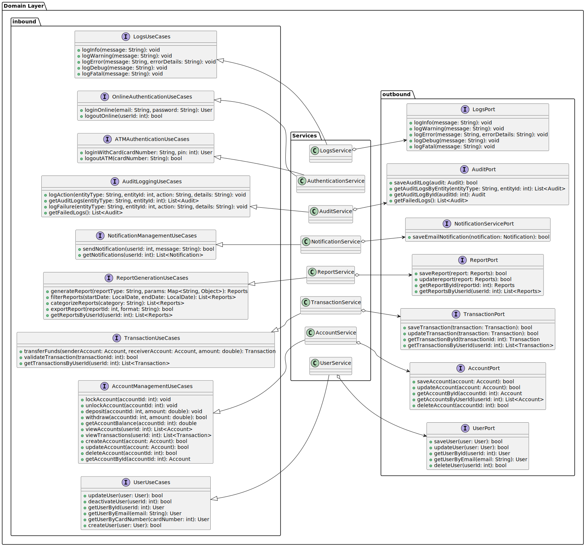
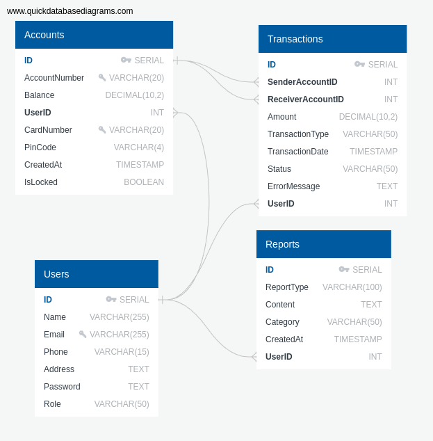
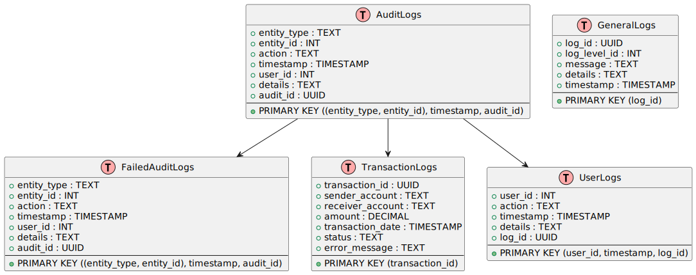

# Banking System

## 1. Overview of the System

The system is designed to handle user management, account management, transactions, reports, notifications, audit logs, and logging for a banking system. It employs Hexagonal Architecture, using Spring Boot as the main backend framework, and supports two databases to ensure data persistence and consistency.

---

## 2. Functional Requirements

These requirements specify what the system must do and its core features:

### User Management:
- Allow user registration, authentication, and management (update, delete).
- Support different user roles such as Customer and Admin.

### Account Management:
- Manage user accounts with features like create, update, delete, and lock/unlock accounts.
- View account balance, transaction history, and transfer funds.
- Deposit and withdraw money with validation of sufficient funds and PIN authentication.
- Link accounts to transactions.

### Transaction Management:
- Handle funds transfer between accounts.
- Support transaction validation, status tracking, and fund transfers to/from accounts.
- Track transaction details such as amount, transaction type, and user details.

### Report Generation:
- Admins can generate reports based on different parameters (e.g., transaction history, user activity).
- Reports should allow filtering, categorization, and exporting in various formats.
- Users can view their reports (e.g., statement of accounts, transaction history).

### Notification System:
- Notify users of important events like successful transactions and account balance updates.
- Store notifications and associate them with users.

### Audit Logging:
- Record system actions such as account updates, user activity, and transaction processing.
- Provide a history of changes and events with details like entity, action, timestamp, and user involved.

### Logging:
- Track system errors, warnings, and general information.
- Log all actions in the system for troubleshooting and monitoring.

---

## 3. Introduction to Representing the C4 Model

The C4 Model (Context, Container, Component, and Code) is a framework designed to help visualize the architecture of software systems. It focuses on creating clear, hierarchical diagrams that break down the structure and interactions within a system at varying levels of abstraction. It is particularly useful for communicating complex system architectures in a simple, structured way, making it easier to understand by both technical and non-technical stakeholders.

### 3.1 C4 Model - Context Diagram

### 3.2 C4 Model - Container Diagram

### 3.3 C4 Model - Component Diagram

### 3.4 C4 Model - Code Diagram

The Code Diagram represents the most detailed level of the C4 Model, focusing on the Domain Layer. It visualizes the key components of the architecture, including:

- **Inbound Ports:** Interfaces defining use cases and system entry points.
- **Outbound Ports:** Abstractions for external dependencies, such as databases.
- **Services:** Core business logic encapsulated within modular, reusable components. These services implement use cases defined by inbound ports and interact with outbound ports for external communication.
- **Models:** Entities and objects representing the business domain, encapsulating rules and state.

By presenting this layer as a Class Diagram, the relationships between ports, services, and models are clarified. This emphasizes a clean separation of concerns, adherence to Hexagonal Architecture, and a scalable, testable system foundation.

#### Code Diagram - Models

#### Code Diagram - Ports & Services

---

## 4. Database Schemas

### 4.1 PostgreSQL Schema

### 4.2 Cassandra Schema

### 4.3 Why Use Cassandra and PostgreSQL in a Banking System?

In modern banking systems, using Cassandra and PostgreSQL together optimizes the handling of different data types:

- **Cassandra** is ideal for storing logs and audit trails due to its ability to handle high write throughput, scalability, low-latency reads and writes, and efficient time-series data management. It ensures real-time logging and fault tolerance across distributed nodes.
- **PostgreSQL** is used for transactional data such as user accounts, transactions, and sensitive information. Its ACID compliance ensures data integrity, while its support for complex queries, relational integrity, and security features make it suitable for financial data processing and reporting.

By leveraging both databases in a hybrid architecture, the system benefits from Cassandra’s high scalability for log data and PostgreSQL’s reliability for transactional operations, ensuring both performance and data consistency.

---

## 5. Why Hexagonal Architecture for Our Banking System?

Hexagonal Architecture was chosen for our banking system due to its key benefits:

1. **Separation of Concerns:** Keeps core logic independent from external systems like databases or third-party services.
2. **Testability:** Allows for easy unit testing by isolating the business logic.
3. **Flexibility:** Makes it easier to switch external services (e.g., payment gateways) without affecting the core system.
4. **Clearer Layered Structure:** Helps define clean boundaries between services like Account Management and Transaction Services.
5. **Smooth Integrations:** Facilitates clean, decoupled communication with external systems (e.g., ATM or notification services).
6. **Maintainability:** Enhances long-term maintainability by enabling independent evolution of components.

Hexagonal Architecture has made our system more scalable, flexible, and easier to maintain, ensuring smooth development and future integrations.

---

## 6. Ensuring Robust Security in Our Banking System

Security is a top priority in our banking system, and we’ve implemented several layers of protection to safeguard user data and prevent unauthorized access. Here’s how we approach it:

1. **Data Encryption:** All sensitive data, including personal and financial information, is encrypted both at rest and in transit using the latest encryption algorithms (e.g., AES-256, TLS 1.2).
2. **Authentication & Authorization:** We use multi-factor authentication (MFA) to ensure that only authorized users can access the system and perform sensitive actions.
3. **Access Control:** Role-based access control (RBAC) ensures users only have access to the resources they need, minimizing the risk of internal threats.
4. **Secure APIs with JWT:** Our RESTful APIs are secured using JWT (JSON Web Tokens) for user authentication. This ensures that requests are authorized securely, and the token can be validated independently.
5. **Rate Limiting:** To prevent abuse and protect our APIs from brute force attacks, we implement rate-limiting algorithms. Techniques like token bucket or leaky bucket algorithms are used to manage traffic and ensure fair access to resources while protecting the system from overuse.
6. **Real-time Monitoring & Logging:** We continuously monitor system activity and log all events to quickly detect and respond to any suspicious behavior.

---

## 7. Why Use Spring Boot for Banking Systems?

Spring Boot is an excellent choice for banking systems due to its focus on security, scalability, and efficiency. Here’s a quick summary:

1. **Scalability:** Built-in support for handling microservices and asynchronous processing ensures the system scales with demand.
2. **Security:** Integrates seamlessly with Spring Security for authentication, authorization, encryption, and compliance with industry standards like PCI-DSS.
3. **Transaction Management:** Ensures reliable and atomic financial transactions through declarative transaction handling and ACID compliance.
4. **Integration:** Easy integration with legacy systems (e.g., mainframes, databases) via JPA, JDBC, and REST/SOAP APIs.
5. **Multithreading:** Java's threading capabilities combined with Spring Boot's tools help handle concurrent transactions securely and efficiently.

Spring Boot provides the necessary tools to build secure, scalable, and maintainable banking systems, making it a preferred choice for modern financial applications.

